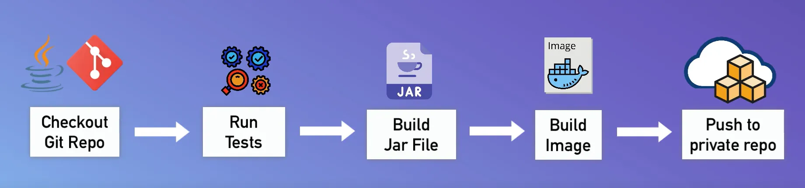

# DevOps Portfolio

Welcome to my DevOps portfolio! This repository highlights the projects I completed, showcasing my hands-on experience with DevOps tools and practices.

- [TWN DevOps Projects](#twn-devops-projects)  
- [The University of Chicago](#the-university-of-chicago)  
- [Other DevOps Projects](#other-devops-projects)

---

## TWN DevOps Projects

Here are the projects I completed during the TWN DevOps Bootcamp:

### Build Automation & CI/CD with Jenkins

  
<strong> 🟢 Demo Project: Install Jenkins on DigitalOcean</strong>
 

  **Technologies Used**:
  Jenkins, Docker, DigitalOcean, Linux 
  **Project Description:**
  - Create an Ubuntu server on DigitalOcean.
  - Set up and run Jenkins as a Docker container.
  - Initialize Jenkins and configure it for CI/CD.
  For detailed **steps and processes** followed during the project, please refer to the attached [PDF](./assets/twn-devops-projects/01-jenkins/Demo_Project_Install_Jenkins_on_DigitalOcean.pdf) document.

---

  
<strong> 🟢 Demo Project: Create a CI Pipeline with Jenkinsfile (Freestyle, Pipeline, Multibranch Pipeline) </strong>
 

**Technologies Used:**
Jenkins, Docker, Linux, Git, Java, Maven 

**Project Description:**
CI Pipeline for a Java Maven application to build and push to the repository:
- Install Build Tools (Maven, Node) in Jenkins
- Make Docker available on Jenkins server
- Create Jenkins credentials for a Git repository
- Create different Jenkins job types (Freestyle, Pipeline (with Jenkinsfile), Multibranch pipeline (with Jenkinsfile)) for the Java Maven project to:
  - Connect to the application’s Git repository
  - Build Jar
  - Build Docker Image
  - Push to a private DockerHub repository

Below is a visual representation of the pipeline:

For setup guidance, please refer to the attached [Setup Guide PDF](./assets/twn-devops-projects/01-jenkins/Setup_Guide_Demo_Project_Create_a_CI_Pipeline_with_Jenkinsfile.pdf).  

For detailed **steps and processes** followed during the project, please refer to the attached [PDF](./assets/twn-devops-projects/01-jenkins/Demo_Project_Create_a_CI_Pipeline_with_Jenkinsfile.pdf) document.

If you would like to explore the code for this project, please visit this [GitLab repository](https://gitlab.com/twn-devops-projects/jenkins/java-maven-app/-/tree/main?ref_type=heads).

---

---
---
## The University of Chicago

Here are the projects I completed during when studying at The University of Chicago:

  
<strong> 🟢 Setting up a Virtual Machine and Getting Started</strong>
 

  **Technologies Used:**

  **Project Description:**

  For detailed **steps and processes** followed during the project, please refer to the attached [PDF](./assets/the-university-of-chicago/Assignment_1_Setting_up_a_Virtual_Machine_and_Getting_Started.pdf) document.

  ---

  
<strong> 🟢 Cloud Computing</strong>
 

  **Technologies Used:**

  **Project Description:**

For detailed **steps and processes** followed during the project, please refer to the attached [PDF](./assets/the-university-of-chicago/Assignment_2_Cloud_Computing.pdf) document.

---

  
<strong> 🟢 Create an Open-Source Software</strong>
 

  **Technologies Used:**

  **Project Description:**

For detailed **steps and processes** followed during the project, please refer to the attached [PDF](./assets/the-university-of-chicago/Assignment_3_Create_an_Open-Source_Software.pdf) document.

---

  
<strong> 🟢 Git Repository</strong>
 

  **Technologies Used:**

  **Project Description:**

For detailed **steps and processes** followed during the project, please refer to the attached [PDF](./assets/the-university-of-chicago/Assignment_4_Git_Repository.pdf) document.

---

  
<strong> 🟢 Creating a CI Environment</strong>
 

  **Technologies Used:**

  **Project Description:**

For detailed **steps and processes** followed during the project, please refer to the attached [PDF](./assets/the-university-of-chicago/Assignment_5_Creating_a_CI_Environment.pdf) document.

---

  
<strong> 🟢 Deploying with Docker</strong>
 

  **Technologies Used:**

  **Project Description:**

For detailed **steps and processes** followed during the project, please refer to the attached [PDF](./assets/the-university-of-chicago/Assignment_6_Deploying_with_Docker.pdf) document.

---

  
<strong> 🟢 Creating an Amazon RDS MySQL Database for Software Configuration</strong>
 

  **Technologies Used:**

  **Project Description:**

For detailed **steps and processes** followed during the project, please refer to the attached [PDF](./assets/the-university-of-chicago/Assignment_7_Creating_an_Amazon_RDS_MySQL_Database_for_Software_Configuration.pdf) document.

---

  
<strong> 🟢 Datadog Dashboard</strong>
 

  **Technologies Used:**

  **Project Description:**

For detailed **steps and processes** followed during the project, please refer to the attached [PDF](./assets/the-university-of-chicago/Assignment_8_Datadog_Dashboard.pdf) document.

---

---
---

## Other DevOps Projects

These are additional projects I worked on to expand my DevOps expertise:

---
