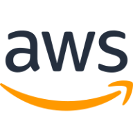
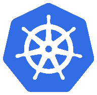
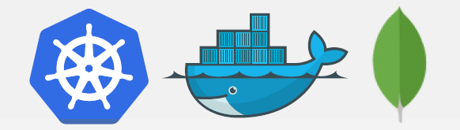
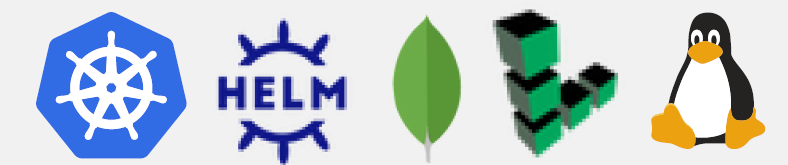
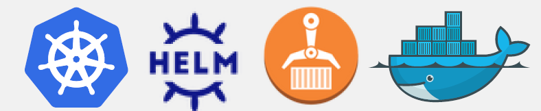
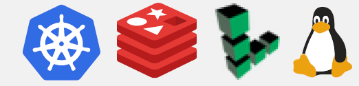
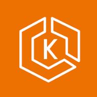
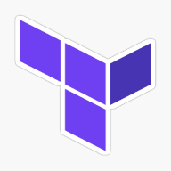
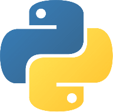

# DevOps Portfolio

Welcome to my DevOps portfolio! This repository highlights the projects I completed, showcasing my hands-on experience with DevOps tools and practices.

- [TWN DevOps Projects](#twn-devops-projects)  
- [The University of Chicago](#the-university-of-chicago)  
- [Other DevOps Projects](#other-devops-projects)

---

## TWN DevOps Projects

Here are the projects I completed during the TWN DevOps Bootcamp:

### Build Automation & CI/CD with Jenkins 

  
<strong> 🟢 Demo Project: Install Jenkins on DigitalOcean</strong>
 

**Technologies Used**:
Jenkins, Docker, DigitalOcean, Linux 

**Project Description:**
- Create an Ubuntu server on DigitalOcean.
- Set up and run Jenkins as a Docker container.
- Initialize Jenkins and configure it for CI/CD.
For detailed **steps and processes** followed during the project, please refer to the attached [PDF](./assets/twn-devops-projects/01-jenkins/Demo_Project_Install_Jenkins_on_DigitalOcean.pdf) document.

---

  
<strong> 🟢 Demo Project: Create a CI Pipeline with Jenkinsfile (Freestyle, Pipeline, Multibranch Pipeline) </strong>
 

**Technologies Used:**
Jenkins, Docker, Linux, Git, Java, Maven 

**Project Description:**
CI Pipeline for a Java Maven application to build and push to the repository:
- Install Build Tools (Maven, Node) in Jenkins
- Make Docker available on Jenkins server
- Create Jenkins credentials for a Git repository
- Create different Jenkins job types (Freestyle, Pipeline (with Jenkinsfile), Multibranch pipeline (with Jenkinsfile)) for the Java Maven project to:
  - Connect to the application’s Git repository
  - Build Jar
  - Build Docker Image
  - Push to a private DockerHub repository

Below is a visual representation of the pipeline:

For setup guidance, please refer to the attached [Setup Guide PDF](./assets/twn-devops-projects/01-jenkins/Setup_Guide_Demo_Project_Create_a_CI_Pipeline_with_Jenkinsfile.pdf).  

For detailed **steps and processes** followed during the project, please refer to the attached [PDF](./assets/twn-devops-projects/01-jenkins/Demo_Project_Create_a_CI_Pipeline_with_Jenkinsfile.pdf) document.

If you would like to explore the code for this project, please visit this [GitLab repository](https://gitlab.com/twn-devops-projects/jenkins/java-maven-app/-/tree/main?ref_type=heads).

---

  
<strong>🟢 Demo Project: Create a Jenkins Shared Library</strong>
 

**Technologies Used**:  
Jenkins, Groovy, Docker, Git, Java, Maven 

**Project Description:**
- Create a separate Git repository for the Jenkins Shared Library project
- Create functions in the JSL to use in the Jenkins pipeline
- Integrate and use the JSL in Jenkins Pipeline (globally and for a specific project in Jenkinsfile)

For detailed **steps and processes** followed during the project, please refer to the attached [PDF](./assets/twn-devops-projects/01-jenkins/Demo_Project_Create_a_Jenkins_Shared_Library.pdf) document.

If you would like to explore the code for this project, please visit this [GitLab repository](https://gitlab.com/twn-devops-projects/jenkins/jenkins-shared-library).

---

  
<strong>🟢 Demo Project: Configure Webhook to trigger CI Pipeline automatically on every change</strong>
 

**Technologies Used**:  
Jenkins, Docker, GitLab, Git, Java, Maven 

**Project Description:**
- Install GitLab Plugin in Jenkins
- Configure GitLab access token and connection to Jenkins in GitLab project settings
- Configure Jenkins to trigger the CI pipeline whenever a change is pushed to GitLab

For detailed **steps and processes** followed during the project, please refer to the attached [PDF](./assets/twn-devops-projects/01-jenkins/Demo_Project_Configure_Webhook_to_trigger_CI_Pipeline_automatically_on_every_change.pdf) document.

Note: There is no **GitLab repository** for this project since it focuses on setting up the Webhook.

---

  
<strong>🟢 Demo Project: Dynamically Increment Application version in Jenkins Pipeline</strong>
 

**Technologies Used**:  
Jenkins, Docker, GitLab, Git, Java, Maven 

**Project Description:**
- Configure CI step: Increment patch version
- Configure CI step: Build Java application and clean old artifacts
- Configure CI step: Build image with dynamic Docker Image Tag
- Configure CI step: Push image to private DockerHub repository
- Configure CI step: Commit version update of Jenkins back to Git repository
- Configure Jenkins pipeline to avoid commit loop by not triggering on version bump commits

For detailed **steps and processes** followed during the project, please refer to the attached [PDF](./assets/twn-devops-projects/01-jenkins/Demo_Project_Dynamically_Increment_Application_version_in_Jenkins_Pipeline.pdf) document.

If you would like to explore the code for this project, please visit this [GitLab repository](https://gitlab.com/twn-devops-projects/jenkins/java-maven-app/-/tree/jenkins-jobs?ref_type=heads).

---

<!----------------------------------------------------------------------------------------------------------------------------->

---
### AWS Services 

  
<strong>🟢 Demo Project: Deploy Web Application on EC2 Instance (manually)</strong>
 

**Technologies Used**:  
AWS, Docker, Linux 

**Project Description:**
- Create and configure an EC2 Instance on AWS
- Install Docker on remote EC2 Instance
- Deploy Docker image from private Docker repository on EC2 Instance

For detailed **steps and processes** followed during the project, please refer to the attached [PDF](./assets/twn-devops-projects/02-aws/Demo_Project_Deploy_Web_Application_on_EC2_Instance_manually.pdf) document.

---

  
<strong>🟢 Demo Project: CD - Deploy Application from Jenkins Pipeline to EC2 Instance (automatically with docker)</strong>
 

**Technologies Used**:  
AWS, Jenkins, Docker, Linux, Git, Java, Maven, Docker Hub 

**Project Description:**
- Prepare AWS EC2 Instance for deployment (Install Docker)
- Create SSH key credentials for EC2 server on Jenkins
- Extend the previous CI pipeline with deploy step to SSH into the remote EC2 instance and deploy newly built image from Jenkins server
- Configure security group on EC2 Instance to allow access to our web application

For detailed **steps and processes** followed during the project, please refer to the attached [PDF](./assets/twn-devops-projects/02-aws/Demo_Protect_CD_-_Deploy_Application_from_Jenkins_Pipeline_to_EC2_Instance_(automatically_with_docker).pdf) document.

If you would like to explore the code for this project, please visit this [GitLab repository](https://gitlab.com/twn-devops-projects/aws/java-maven-app/-/blob/feature/payment/Jenkinsfile?ref_type=heads).

---

  
<strong>🟢 Demo Project: CD - Deploy Application from Jenkins Pipeline on EC2 Instance (automatically with docker-compose)</strong>
 

**Technologies Used**:  
AWS, Jenkins, Docker, Linux, Git, Java, Maven, Docker Hub 

**Project Description:**
- Install Docker Compose on AWS EC2 Instance
- Create `docker-compose.yml` file that deploys our web application image
- Configure Jenkins pipeline to deploy newly built image using Docker Compose on EC2 server
- Improvement: Extract multiple Linux commands that are executed on remote server into a separate shell script and execute the script from Jenkinsfile

For detailed **steps and processes** followed during the project, please refer to the attached [PDF](./assets/twn-devops-projects/02-aws/Demo_Project_CD_-_Deploy_Application_from_Jenkins_Pipeline_on_EC2_Instance_(automatically_with_docker-compose).pdf) document.

If you would like to explore the code for this project, please visit this [GitLab repository](https://gitlab.com/twn-devops-projects/aws/java-maven-app/-/tree/jenkins-jobs?ref_type=heads).

---

  
<strong>🟢 Demo Project: Complete the CI/CD Pipeline (Docker-Compose, Dynamic versioning)</strong>
 

**Technologies Used**:  
AWS, Jenkins, Docker, Linux, Git, Java, Maven, Docker Hub 

**Project Description:**
- CI step: Increment version
- CI step: Build artifact for Java Maven application
- CI step: Build and push Docker image to Docker Hub
- CD step: Deploy new application version with Docker Compose
- CD step: Commit the version update

For detailed **steps and processes** followed during the project, please refer to the attached [PDF](./assets/twn-devops-projects/02-aws/Demo_Project_Complete_the_CICD_Pipeline_(Docker-Compose_Dynamic_versioning).pdf) document.

If you would like to explore the code for this project, please visit this [GitLab repository](https://gitlab.com/twn-devops-projects/aws/java-maven-app/-/tree/jenkins-jobs?ref_type=heads).

---

  
<strong>🟢 Demo Project: Interacting with AWS CLI</strong>
 

**Technologies Used**:  
AWS, Linux 

**Project Description:**
- Install and configure AWS CLI tool to connect to our AWS account
- Create EC2 Instance using the AWS CLI with all necessary configurations like Security Group
- Create SSH key pair
- Create IAM resources like User, Group, Policy using the AWS CLI
- List and browse AWS resources using the AWS CLI

For detailed **steps and processes** followed during the project, please refer to the attached [PDF](./assets/twn-devops-projects/02-aws/Demo_Project_Interacting_with_AWS_CLI.pdf) document.

---

<!----------------------------------------------------------------------------------------------------------------------------->

---
### Container Orchestration with Kubernetes 

  
<strong> 🟢 Demo Project: Deploy MongoDB and Mongo Express into local K8s cluster</strong>
 

  **Technologies Used**:  
  Kubernetes, Docker, MongoDB, Mongo Express 

  **Project Description:**
  - Setup local K8s cluster with Minikube
  - Deploy MongoDB and MongoExpress with configuration and credentials extracted into ConfigMap and Secret

  For detailed **steps and processes** followed during the project, please refer to the attached [PDF](./assets/twn-devops-projects/03-kubernetes/Demo_Project_Deploy_MongoDB_and_Mongo_Express_into_local_K8s_cluster.pdf) document.

  If you would like to explore the code for this project, please visit this [GitLab repository](https://gitlab.com/twn-devops-projects/kubernetes/demo-deploying-application).

---

  
<strong> 🟢 Demo Project: Deploy Mosquitto message broker with ConfigMap and Secret Volume Types</strong>
 

  **Technologies Used**:  
  Kubernetes, Docker, Mosquitto 

  **Project Description:**
  - Define configuration and passwords for Mosquitto message broker with ConfigMap and Secret Volume types

  For detailed **steps and processes** followed during the project, please refer to the attached [PDF](./assets/twn-devops-projects/03-kubernetes/Demo_Project_Deploy_Mosquitto_message_broker_with_ConfigMap_and_Secret_Volume_Types.pdf) document.

  If you would like to explore the code for this project, please visit this [GitLab repository](https://gitlab.com/twn-devops-projects/kubernetes/configmap-and-secret-volume-types).

---

  
<strong> 🟢 Demo Project: Install a stateful service (MongoDB) on Kubernetes using Helm</strong>
 

  **Technologies Used**:  
  K8s, Helm, MongoDB, Mongo Express, Linode LKE, Linux 

  **Project Description:**
  - Create a managed K8s cluster with Linode Kubernetes Engine
  - Deploy replicated MongoDB service in LKE cluster using a Helm chart
  - Configure data persistence for MongoDB with Linode’s cloud storage
  - Deploy UI client Mongo Express for MongoDB
  - Deploy and configure nginx ingress to access the UI application from browser

  For detailed **steps and processes** followed during the project, please refer to the attached [PDF](./assets/twn-devops-projects/03-kubernetes/Demo_Project_Install_a_stateful_(MongoDB)_on_Kubernetes_using_Helm.pdf) document.

  If you would like to explore the code for this project, please visit this [GitLab repository](https://gitlab.com/twn-devops-projects/kubernetes/helm-demo).

---

  
<strong> 🟢 Demo Project: Deploy our web application in K8s cluster from private Docker registry</strong>
 

  **Technologies Used**:  
  Kubernetes, Helm, AWS ECR, Docker 

  **Project Description:**
  - Create Secret for credentials for the private Docker registry
  - Configure the Docker registry secret in application Deployment component
  - Deploy web application image from our private Docker registry in K8s cluster

  For detailed **steps and processes** followed during the project, please refer to the attached [PDF](./assets/twn-devops-projects/03-kubernetes/Demo_Project_Deploy_our_web_application_in_K8s_cluster_from_private_Docker_registry.pdf) document.

  If you would like to explore the code for this project, please visit this [GitLab repository](https://gitlab.com/twn-devops-projects/kubernetes/deploying-images-from-private-docker-repo).

---

  
<strong> 🟢 Demo Project: Deploy Microservices application in Kubernetes with Production and Security Best Practices</strong>
 

  **Technologies Used**:  
  Kubernetes, Redis, Linux, Linode LKE 

  **Project Description:**
  - Create K8s manifests for Deployments and Services for all microservices of an online shop application
  - Deploy microservices to Linode’s managed Kubernetes cluster

  For detailed **steps and processes** followed during the project, please refer to the attached [PDF](./assets/twn-devops-projects/03-kubernetes/Demo_Project_Deploy_Microservices_application_in_Kubernetes_with_Production_Security_Best_Practices.pdf) document.

  If you would like to explore the code for this project, please visit this [GitLab repository](https://gitlab.com/twn-devops-projects/kubernetes/helm-chart-microservices).

---

  
<strong> 🟢 Demo Project: Create Helm Chart for Microservices</strong>
 

  **Technologies Used**:  
  Kubernetes, Helm 

  **Project Description:**
  - Create 1 shared Helm Chart for all microservices, to reuse common Deployment and Service configurations for the services

  For detailed **steps and processes** followed during the project, please refer to the attached [PDF](./assets/twn-devops-projects/03-kubernetes/Demo_Project_Create_Helm_Chart_for_Microservices.pdf) document.

  If you would like to explore the code for this project, please visit this [GitLab repository](https://gitlab.com/twn-devops-projects/kubernetes/helm-chart-microservices).

---

  
<strong> 🟢 Demo Project: Deploy Microservices with Helmfile</strong>
 

  **Technologies Used**:  
  Kubernetes, Helm, Helmfile 

  **Project Description:**
  - Deploy Microservices with Helm
  - Deploy Microservices with Helmfile

  For detailed **steps and processes** followed during the project, please refer to the attached [PDF](./assets/twn-devops-projects/03-kubernetes/Demo_Project_Deploy_Microservices_with_Helmfile.pdf) document.

  If you would like to explore the code for this project, please visit this [GitLab repository](https://gitlab.com/twn-devops-projects/kubernetes/helm-chart-microservices).

---

<!----------------------------------------------------------------------------------------------------------------------------->

---
### Kubernetes on AWS - EKS 

<!----------------------------------------------------------------------------------------------------------------------------->

---
### Infrastructure as Code with Terraform 

<!----------------------------------------------------------------------------------------------------------------------------->

---
### Programming with Python 

<!----------------------------------------------------------------------------------------------------------------------------->

---
### Automation with Python 

<!----------------------------------------------------------------------------------------------------------------------------->

---
### Configuration Management with Ansible 

<!----------------------------------------------------------------------------------------------------------------------------->

---
### Monitoring with Prometheus 

<!----------------------------------------------------------------------------------------------------------------------------->

[Back to the top](#devops-portfolio)

---
---
## The University of Chicago

Here are the projects I completed during when studying at The University of Chicago:

  
<strong> 🟢 Setting up a Virtual Machine and Getting Started</strong>
 

  **Technologies Used:**

  **Project Description:**

  For detailed **steps and processes** followed during the project, please refer to the attached [PDF](./assets/the-university-of-chicago/Assignment_1_Setting_up_a_Virtual_Machine_and_Getting_Started.pdf) document.

  ---

  
<strong> 🟢 Cloud Computing</strong>
 

  **Technologies Used:**

  **Project Description:**

For detailed **steps and processes** followed during the project, please refer to the attached [PDF](./assets/the-university-of-chicago/Assignment_2_Cloud_Computing.pdf) document.

---

  
<strong> 🟢 Create an Open-Source Software</strong>
 

  **Technologies Used:**

  **Project Description:**

For detailed **steps and processes** followed during the project, please refer to the attached [PDF](./assets/the-university-of-chicago/Assignment_3_Create_an_Open-Source_Software.pdf) document.

---

  
<strong> 🟢 Git Repository</strong>
 

  **Technologies Used:**

  **Project Description:**

For detailed **steps and processes** followed during the project, please refer to the attached [PDF](./assets/the-university-of-chicago/Assignment_4_Git_Repository.pdf) document.

---

  
<strong> 🟢 Creating a CI Environment</strong>
 

  **Technologies Used:**

  **Project Description:**

For detailed **steps and processes** followed during the project, please refer to the attached [PDF](./assets/the-university-of-chicago/Assignment_5_Creating_a_CI_Environment.pdf) document.

---

  
<strong> 🟢 Deploying with Docker</strong>
 

  **Technologies Used:**

  **Project Description:**

For detailed **steps and processes** followed during the project, please refer to the attached [PDF](./assets/the-university-of-chicago/Assignment_6_Deploying_with_Docker.pdf) document.

---

  
<strong> 🟢 Creating an Amazon RDS MySQL Database for Software Configuration</strong>
 

  **Technologies Used:**

  **Project Description:**

For detailed **steps and processes** followed during the project, please refer to the attached [PDF](./assets/the-university-of-chicago/Assignment_7_Creating_an_Amazon_RDS_MySQL_Database_for_Software_Configuration.pdf) document.

---

  
<strong> 🟢 Datadog Dashboard</strong>
 

  **Technologies Used:**

  **Project Description:**

For detailed **steps and processes** followed during the project, please refer to the attached [PDF](./assets/the-university-of-chicago/Assignment_8_Datadog_Dashboard.pdf) document.

---

[Back to the top](#devops-portfolio)

---
---

## Other DevOps Projects

These are additional projects I worked on to expand my DevOps expertise:

[Back to the top](#devops-portfolio)

---
