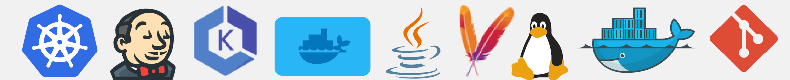
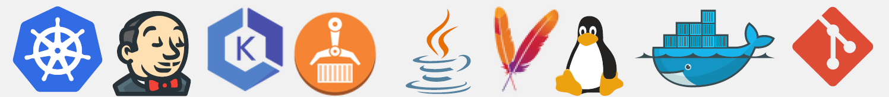

# DevOps Portfolio

Welcome to my DevOps portfolio! This repository highlights the projects I completed, showcasing my hands-on experience with DevOps tools and practices.

- [TWN DevOps Projects](#twn-devops-projects)  
- [The University of Chicago](#the-university-of-chicago)  
- [Other DevOps Projects](#other-devops-projects)

---

## TWN DevOps Projects

Here are the projects I completed during the TWN DevOps Bootcamp:

### Build Automation & CI/CD with Jenkins 

  
<strong> 🟢 Demo Project: Install Jenkins on DigitalOcean</strong>
 

**Technologies Used**:
Jenkins, Docker, DigitalOcean, Linux 

**Project Description:**
- Create an Ubuntu server on DigitalOcean.
- Set up and run Jenkins as a Docker container.
- Initialize Jenkins and configure it for CI/CD.
For detailed **steps and processes** followed during the project, please refer to the attached [PDF](./assets/twn-devops-projects/01-jenkins/Demo_Project_Install_Jenkins_on_DigitalOcean.pdf) document.

---

  
<strong> 🟢 Demo Project: Create a CI Pipeline with Jenkinsfile (Freestyle, Pipeline, Multibranch Pipeline) </strong>
 

**Technologies Used:**
Jenkins, Docker, Linux, Git, Java, Maven 

**Project Description:**
CI Pipeline for a Java Maven application to build and push to the repository:
- Install Build Tools (Maven, Node) in Jenkins
- Make Docker available on Jenkins server
- Create Jenkins credentials for a Git repository
- Create different Jenkins job types (Freestyle, Pipeline (with Jenkinsfile), Multibranch pipeline (with Jenkinsfile)) for the Java Maven project to:
  - Connect to the application’s Git repository
  - Build Jar
  - Build Docker Image
  - Push to a private DockerHub repository

Below is a visual representation of the pipeline:

For setup guidance, please refer to the attached [Setup Guide PDF](./assets/twn-devops-projects/01-jenkins/Setup_Guide_Demo_Project_Create_a_CI_Pipeline_with_Jenkinsfile.pdf).  

For detailed **steps and processes** followed during the project, please refer to the attached [PDF](./assets/twn-devops-projects/01-jenkins/Demo_Project_Create_a_CI_Pipeline_with_Jenkinsfile.pdf) document.

If you would like to explore the code for this project, please visit this [GitLab repository](https://gitlab.com/twn-devops-projects/jenkins/java-maven-app/-/tree/main?ref_type=heads).

---

  
<strong>🟢 Demo Project: Create a Jenkins Shared Library</strong>
 

**Technologies Used**:  
Jenkins, Groovy, Docker, Git, Java, Maven 

**Project Description:**
- Create a separate Git repository for the Jenkins Shared Library project
- Create functions in the JSL to use in the Jenkins pipeline
- Integrate and use the JSL in Jenkins Pipeline (globally and for a specific project in Jenkinsfile)

For detailed **steps and processes** followed during the project, please refer to the attached [PDF](./assets/twn-devops-projects/01-jenkins/Demo_Project_Create_a_Jenkins_Shared_Library.pdf) document.

If you would like to explore the code for this project, please visit this [GitLab repository](https://gitlab.com/twn-devops-projects/jenkins/jenkins-shared-library).

---

  
<strong>🟢 Demo Project: Configure Webhook to trigger CI Pipeline automatically on every change</strong>
 

**Technologies Used**:  
Jenkins, Docker, GitLab, Git, Java, Maven 

**Project Description:**
- Install GitLab Plugin in Jenkins
- Configure GitLab access token and connection to Jenkins in GitLab project settings
- Configure Jenkins to trigger the CI pipeline whenever a change is pushed to GitLab

For detailed **steps and processes** followed during the project, please refer to the attached [PDF](./assets/twn-devops-projects/01-jenkins/Demo_Project_Configure_Webhook_to_trigger_CI_Pipeline_automatically_on_every_change.pdf) document.

Note: There is no **GitLab repository** for this project since it focuses on setting up the Webhook.

---

  
<strong>🟢 Demo Project: Dynamically Increment Application version in Jenkins Pipeline</strong>
 

**Technologies Used**:  
Jenkins, Docker, GitLab, Git, Java, Maven 

**Project Description:**
- Configure CI step: Increment patch version
- Configure CI step: Build Java application and clean old artifacts
- Configure CI step: Build image with dynamic Docker Image Tag
- Configure CI step: Push image to private DockerHub repository
- Configure CI step: Commit version update of Jenkins back to Git repository
- Configure Jenkins pipeline to avoid commit loop by not triggering on version bump commits

For detailed **steps and processes** followed during the project, please refer to the attached [PDF](./assets/twn-devops-projects/01-jenkins/Demo_Project_Dynamically_Increment_Application_version_in_Jenkins_Pipeline.pdf) document.

If you would like to explore the code for this project, please visit this [GitLab repository](https://gitlab.com/twn-devops-projects/jenkins/java-maven-app/-/tree/jenkins-jobs?ref_type=heads).

---

<!----------------------------------------------------------------------------------------------------------------------------->

---
### AWS Services 

  
<strong>🟢 Demo Project: Deploy Web Application on EC2 Instance (manually)</strong>
 

**Technologies Used**:  
AWS, Docker, Linux 

**Project Description:**
- Create and configure an EC2 Instance on AWS
- Install Docker on remote EC2 Instance
- Deploy Docker image from private Docker repository on EC2 Instance

For detailed **steps and processes** followed during the project, please refer to the attached [PDF](./assets/twn-devops-projects/02-aws/Demo_Project_Deploy_Web_Application_on_EC2_Instance_manually.pdf) document.

---

  
<strong>🟢 Demo Project: CD - Deploy Application from Jenkins Pipeline to EC2 Instance (automatically with docker)</strong>
 

**Technologies Used**:  
AWS, Jenkins, Docker, Linux, Git, Java, Maven, Docker Hub 

**Project Description:**
- Prepare AWS EC2 Instance for deployment (Install Docker)
- Create SSH key credentials for EC2 server on Jenkins
- Extend the previous CI pipeline with deploy step to SSH into the remote EC2 instance and deploy newly built image from Jenkins server
- Configure security group on EC2 Instance to allow access to our web application

For detailed **steps and processes** followed during the project, please refer to the attached [PDF](./assets/twn-devops-projects/02-aws/Demo_Protect_CD_-_Deploy_Application_from_Jenkins_Pipeline_to_EC2_Instance_(automatically_with_docker).pdf) document.

If you would like to explore the code for this project, please visit this [GitLab repository](https://gitlab.com/twn-devops-projects/aws/java-maven-app/-/blob/feature/payment/Jenkinsfile?ref_type=heads).

---

  
<strong>🟢 Demo Project: CD - Deploy Application from Jenkins Pipeline on EC2 Instance (automatically with docker-compose)</strong>
 

**Technologies Used**:  
AWS, Jenkins, Docker, Linux, Git, Java, Maven, Docker Hub 

**Project Description:**
- Install Docker Compose on AWS EC2 Instance
- Create `docker-compose.yml` file that deploys our web application image
- Configure Jenkins pipeline to deploy newly built image using Docker Compose on EC2 server
- Improvement: Extract multiple Linux commands that are executed on remote server into a separate shell script and execute the script from Jenkinsfile

For detailed **steps and processes** followed during the project, please refer to the attached [PDF](./assets/twn-devops-projects/02-aws/Demo_Project_CD_-_Deploy_Application_from_Jenkins_Pipeline_on_EC2_Instance_(automatically_with_docker-compose).pdf) document.

If you would like to explore the code for this project, please visit this [GitLab repository](https://gitlab.com/twn-devops-projects/aws/java-maven-app/-/tree/jenkins-jobs?ref_type=heads).

---

  
<strong>🟢 Demo Project: Complete the CI/CD Pipeline (Docker-Compose, Dynamic versioning)</strong>
 

**Technologies Used**:  
AWS, Jenkins, Docker, Linux, Git, Java, Maven, Docker Hub 

**Project Description:**
- CI step: Increment version
- CI step: Build artifact for Java Maven application
- CI step: Build and push Docker image to Docker Hub
- CD step: Deploy new application version with Docker Compose
- CD step: Commit the version update

For detailed **steps and processes** followed during the project, please refer to the attached [PDF](./assets/twn-devops-projects/02-aws/Demo_Project_Complete_the_CICD_Pipeline_(Docker-Compose_Dynamic_versioning).pdf) document.

If you would like to explore the code for this project, please visit this [GitLab repository](https://gitlab.com/twn-devops-projects/aws/java-maven-app/-/tree/jenkins-jobs?ref_type=heads).

---

  
<strong>🟢 Demo Project: Interacting with AWS CLI</strong>
 

**Technologies Used**:  
AWS, Linux 

**Project Description:**
- Install and configure AWS CLI tool to connect to our AWS account
- Create EC2 Instance using the AWS CLI with all necessary configurations like Security Group
- Create SSH key pair
- Create IAM resources like User, Group, Policy using the AWS CLI
- List and browse AWS resources using the AWS CLI

For detailed **steps and processes** followed during the project, please refer to the attached [PDF](./assets/twn-devops-projects/02-aws/Demo_Project_Interacting_with_AWS_CLI.pdf) document.

---

<!----------------------------------------------------------------------------------------------------------------------------->

---
### Container Orchestration with Kubernetes 

  
<strong> 🟢 Demo Project: Deploy MongoDB and Mongo Express into local K8s cluster</strong>
 

  **Technologies Used**:  
  Kubernetes, Docker, MongoDB, Mongo Express 

  **Project Description:**
  - Setup local K8s cluster with Minikube
  - Deploy MongoDB and MongoExpress with configuration and credentials extracted into ConfigMap and Secret

  For detailed **steps and processes** followed during the project, please refer to the attached [PDF](./assets/twn-devops-projects/03-kubernetes/Demo_Project_Deploy_MongoDB_and_Mongo_Express_into_local_K8s_cluster.pdf) document.

  If you would like to explore the code for this project, please visit this [GitLab repository](https://gitlab.com/twn-devops-projects/kubernetes/demo-deploying-application).

---

  
<strong> 🟢 Demo Project: Deploy Mosquitto message broker with ConfigMap and Secret Volume Types</strong>
 

  **Technologies Used**:  
  Kubernetes, Docker, Mosquitto 

  **Project Description:**
  - Define configuration and passwords for Mosquitto message broker with ConfigMap and Secret Volume types

  For detailed **steps and processes** followed during the project, please refer to the attached [PDF](./assets/twn-devops-projects/03-kubernetes/Demo_Project_Deploy_Mosquitto_message_broker_with_ConfigMap_and_Secret_Volume_Types.pdf) document.

  If you would like to explore the code for this project, please visit this [GitLab repository](https://gitlab.com/twn-devops-projects/kubernetes/configmap-and-secret-volume-types).

---

  
<strong> 🟢 Demo Project: Install a stateful service (MongoDB) on Kubernetes using Helm</strong>
 

  **Technologies Used**:  
  K8s, Helm, MongoDB, Mongo Express, Linode LKE, Linux 

  **Project Description:**
  - Create a managed K8s cluster with Linode Kubernetes Engine
  - Deploy replicated MongoDB service in LKE cluster using a Helm chart
  - Configure data persistence for MongoDB with Linode’s cloud storage
  - Deploy UI client Mongo Express for MongoDB
  - Deploy and configure nginx ingress to access the UI application from browser

  For detailed **steps and processes** followed during the project, please refer to the attached [PDF](./assets/twn-devops-projects/03-kubernetes/Demo_Project_Install_a_stateful_(MongoDB)_on_Kubernetes_using_Helm.pdf) document.

  If you would like to explore the code for this project, please visit this [GitLab repository](https://gitlab.com/twn-devops-projects/kubernetes/helm-demo).

---

  
<strong> 🟢 Demo Project: Deploy our web application in K8s cluster from private Docker registry</strong>
 

  **Technologies Used**:  
  Kubernetes, Helm, AWS ECR, Docker 

  **Project Description:**
  - Create Secret for credentials for the private Docker registry
  - Configure the Docker registry secret in application Deployment component
  - Deploy web application image from our private Docker registry in K8s cluster

  For detailed **steps and processes** followed during the project, please refer to the attached [PDF](./assets/twn-devops-projects/03-kubernetes/Demo_Project_Deploy_our_web_application_in_K8s_cluster_from_private_Docker_registry.pdf) document.

  If you would like to explore the code for this project, please visit this [GitLab repository](https://gitlab.com/twn-devops-projects/kubernetes/deploying-images-from-private-docker-repo).

---

  
<strong> 🟢 Demo Project: Deploy Microservices application in Kubernetes with Production and Security Best Practices</strong>
 

  **Technologies Used**:  
  Kubernetes, Redis, Linux, Linode LKE 

  **Project Description:**
  - Create K8s manifests for Deployments and Services for all microservices of an online shop application
  - Deploy microservices to Linode’s managed Kubernetes cluster

  For detailed **steps and processes** followed during the project, please refer to the attached [PDF](./assets/twn-devops-projects/03-kubernetes/Demo_Project_Deploy_Microservices_application_in_Kubernetes_with_Production_Security_Best_Practices.pdf) document.

  If you would like to explore the code for this project, please visit this [GitLab repository](https://gitlab.com/twn-devops-projects/kubernetes/helm-chart-microservices).

---

  
<strong> 🟢 Demo Project: Create Helm Chart for Microservices</strong>
 

  **Technologies Used**:  
  Kubernetes, Helm 

  **Project Description:**
  - Create 1 shared Helm Chart for all microservices, to reuse common Deployment and Service configurations for the services

  For detailed **steps and processes** followed during the project, please refer to the attached [PDF](./assets/twn-devops-projects/03-kubernetes/Demo_Project_Create_Helm_Chart_for_Microservices.pdf) document.

  If you would like to explore the code for this project, please visit this [GitLab repository](https://gitlab.com/twn-devops-projects/kubernetes/helm-chart-microservices).

---

  
<strong> 🟢 Demo Project: Deploy Microservices with Helmfile</strong>
 

  **Technologies Used**:  
  Kubernetes, Helm, Helmfile 

  **Project Description:**
  - Deploy Microservices with Helm
  - Deploy Microservices with Helmfile

  For detailed **steps and processes** followed during the project, please refer to the attached [PDF](./assets/twn-devops-projects/03-kubernetes/Demo_Project_Deploy_Microservices_with_Helmfile.pdf) document.

  If you would like to explore the code for this project, please visit this [GitLab repository](https://gitlab.com/twn-devops-projects/kubernetes/helm-chart-microservices).

---

<!----------------------------------------------------------------------------------------------------------------------------->

---
### Kubernetes on AWS - EKS 

  
<strong> 🟢 Demo Project: Create AWS EKS cluster with a Node Group</strong>
 

  **Technologies Used**:
  Kubernetes, AWS EKS 

  **Project Description:**
  - Configure necessary IAM Roles
  - Create VPC with Cloudformation Template for Worker Nodes
  - Create EKS cluster (Control Plane Nodes)
  - Create Node Group for Worker Nodes and attach to EKS cluster
  - Configure Auto-Scaling of worker nodes
  - Deploy a sample application to EKS cluster

  For detailed **steps and processes** followed during the project, please refer to the attached [PDF](./assets/twn-devops-projects/04-eks/Demo_Project_Create_AWS_EKS_cluster_with_a_Node_Group.pdf) document.

---

  
<strong> 🟢 Demo Project: Create EKS cluster with Fargate profile</strong>
 

  **Technologies Used**:
  Kubernetes, AWS EKS, AWS Fargate 

  **Project Description:**
  - Create Fargate IAM Role
  - Create Fargate Profile
  - Deploy an example application to EKS cluster using Fargate profile

  For detailed **steps and processes** followed during the project, please refer to the attached [PDF](./assets/twn-devops-projects/04-eks/Demo_Project_Create_EKS_cluster_with_Fargate_profile.pdf) document.

---

  
<strong> 🟢 Demo Project: Create EKS cluster with eksctl</strong>
 

  **Technologies Used**:
  Kubernetes, AWS EKS, Eksctl, Linux 

  **Project Description:**
  - Create EKS cluster using eksctl tool that reduces the manual effort of creating an EKS cluster

  For detailed **steps and processes** followed during the project, please refer to the attached [PDF](./assets/twn-devops-projects/04-eks/Demo_Project_Create_EKS_cluster_with_eksctl.pdf) document.

---

  
<strong> 🟢 Demo Project: CD - Deploy to EKS cluster from Jenkins Pipeline</strong>
 

  **Technologies Used**:
  Kubernetes, Jenkins, AWS EKS, Docker, Linux 

  **Project Description:**
  - Install kubectl and aws-iam-authenticator on a Jenkins server
  - Create kubeconfig file to connect to EKS cluster and add it on Jenkins server
  - Add AWS credentials on Jenkins for AWS account authentication
  - Extend and adjust Jenkinsfile of the previous CI/CD pipeline to configure connection to EKS cluster

  For detailed **steps and processes** followed during the project, please refer to the attached [PDF](./assets/twn-devops-projects/04-eks/Demo_Project_CD_-_Deploy_to_EKS_cluster_from_Jenkins_Pipeline.pdf) document.

  If you would like to explore the code for this project, please visit this [GitLab repository](https://gitlab.com/twn-devops-projects/eks/java-maven-app/-/tree/deploy-on-k8s?ref_type=heads).

---

  
<strong> 🟢 Demo Project: CD - Deploy to LKE cluster from Jenkins Pipeline</strong>
 

  **Technologies Used**:
  Kubernetes, Jenkins, Linode LKE, Docker, Linux 

  **Project Description:**
  - Create K8s cluster on LKE
  - Install kubectl as Jenkins Plugin
  - Adjust Jenkinsfile to use Plugin and deploy to LKE cluster

  For detailed **steps and processes** followed during the project, please refer to the attached [PDF](./assets/twn-devops-projects/04-eks/Demo_Project_CD_-_Deploy_to_LKE_cluster_from_Jenkins_Pipeline.pdf) document.

  If you would like to explore the code for this project, please visit this [GitLab repository](https://gitlab.com/twn-devops-projects/eks/java-maven-app/-/tree/deploy-to-lke?ref_type=heads).

---

  
<strong> 🟢 Demo Project: Complete CI/CD Pipeline with EKS and private DockerHub registry</strong>
 

  **Technologies Used**:
  Kubernetes, Jenkins, AWS EKS, Docker Hub, Java, Maven, Linux, Docker, Git 

  **Project Description:**
  - Write K8s manifest files for Deployment and Service configuration
  - Integrate deploy step in the CI/CD pipeline to deploy newly built application image from DockerHub private registry to the EKS cluster
  - So the complete CI/CD project we build has the following configuration:
    - CI step: Increment version
    - CI step: Build artifact for Java Maven application
    - CI step: Build and push Docker image to DockerHub
    - CD step: Deploy new application version to EKS cluster
    - CD step: Commit the version update

  For detailed **steps and processes** followed during the project, please refer to the attached [PDF](./assets/twn-devops-projects/04-eks/Demo_Project_Complete_CICD_Pipeline_with_EKS_and_private_DockerHub_registry.pdf) document.

  If you would like to explore the code for this project, please visit this [GitLab repository](https://gitlab.com/twn-devops-projects/eks/java-maven-app/-/tree/jenkins-jobs?ref_type=heads).

---

  
<strong> 🟢 Demo Project: Complete CI/CD Pipeline with EKS and AWS ECR</strong>
 

  **Technologies Used**:
  Kubernetes, Jenkins, AWS EKS, AWS ECR, Java, Maven, Linux, Docker, Git 

  **Project Description:**
  - Create private AWS ECR Docker repository
  - Adjust Jenkinsfile to build and push Docker Image to AWS ECR
  - Integrate deploying to K8s cluster in the CI/CD pipeline from AWS ECR private registry
  - So the complete CI/CD project we build has the following configuration:
    - CI step: Increment version
    - CI step: Build artifact for Java Maven application
    - CI step: Build and push Docker image to AWS ECR
    - CD step: Deploy new application version to EKS cluster
    - CD step: Commit the version update

  For detailed **steps and processes** followed during the project, please refer to the attached [PDF](./assets/twn-devops-projects/04-eks/Demo_Project_Complete_CICD_Pipeline_with_EKS_and_AWS_ECR.pdf) document.

  If you would like to explore the code for this project, please visit this [GitLab repository](https://gitlab.com/twn-devops-projects/eks/java-maven-app/-/tree/jenkins-jobs-AWS?ref_type=heads).

---

<!----------------------------------------------------------------------------------------------------------------------------->

---
### Infrastructure as Code with Terraform 

  
<strong>🟢 Demo Project: Automate AWS Infrastructure</strong>
 

  **Technologies Used**:  
  Terraform, AWS, Docker, Linux, Git  
  

  **Project Description:**
  - Create TF project to automate provisioning AWS Infrastructure and its components, such as: VPC, Subnet, Route Table, Internet Gateway, EC2, Security Group
  - Configure TF script to automate deploying Docker container to EC2 instance

  For detailed **steps and processes** followed during the project, please refer to the attached [PDF](twn-devops-projects/05-terraform/assets/Demo_Project_Automate_AWS_Infrastructure.pdf) document.

  GitLab Repositories:  
  - [EC2 + Components](https://gitlab.com/twn-devops-projects/terraform/terraform-learn/-/tree/feature/deploy-to-ec2-default-components?ref_type=heads)  
  - [Provisioners](https://gitlab.com/twn-devops-projects/terraform/terraform-learn/-/tree/feature/provisioners?ref_type=heads)

---

  
<strong>🟢 Demo Project: Modularize Project</strong>
 

  **Technologies Used**:  
  Terraform, AWS, Docker, Linux, Git  
  

  **Project Description:**
  - Divide Terraform resources into reusable modules

  For detailed **steps and processes** followed during the project, please refer to the attached [PDF](twn-devops-projects/05-terraform/assets/Demo_Project_Modularize_Project.pdf) document.

  GitLab Repository:  
  - [Modules](https://gitlab.com/twn-devops-projects/terraform/terraform-learn/-/tree/feature/modules?ref_type=heads)

---

  
<strong>🟢 Demo Project: Terraform and AWS EKS</strong>
 

  **Technologies Used**:  
  Kubernetes, AWS EKS, Eksctl, Linux  
  

  **Project Description:** 
  - Automate provisioning EKS cluster with Terraform

  For detailed **steps and processes** followed during the project, please refer to the attached [PDF](twn-devops-projects/05-terraform/assets/Demo_Project_Terraform_and_AWS_EKS.pdf) document.

  GitLab Repository:  
  - [EKS](https://gitlab.com/twn-devops-projects/terraform/terraform-learn/-/tree/feature/eks?ref_type=heads)

---

  
<strong>🟢 Demo Project: Complete CI/CD with Terraform</strong>
 

  **Technologies Used**:  
  Terraform, Jenkins, Docker, AWS, Git, Java, Maven, Linux, Docker Hub  
  

  **Project Description:**
  Integrate provisioning stage into complete CI/CD Pipeline to automate provisioning server instead of deploying to an existing server
  - Create SSH Key Pair
  - Install Terraform inside Jenkins container
  - Add Terraform configuration to application’s git repository
  - Adjust Jenkinsfile to add “provision” step to the CI/CD pipeline that provisions EC2 instance
  - So the complete CI/CD project we build has the following configuration:
    - CI step: Build artifact for Java Maven application  
    - CI step: Build and push Docker image to Docker Hub  
    - CD step: Automatically provision EC2 instance using TF  
    - CD step: Deploy new application version on the provisioned EC2 instance with Docker Compose

  For detailed **steps and processes** followed during the project, please refer to the attached [PDF](twn-devops-projects/05-terraform/assets/Demo_Project_Complete_CICD_with_Terraform.pdf) document.

  GitLab Repository:  
  - [CI/CD Project](https://gitlab.com/twn-devops-projects/terraform/java-maven-app/-/tree/jenkinsfile-sshagent?ref_type=heads)

---

  
<strong>🟢 Demo Project: Configure a Shared Remote State</strong>
 

  **Technologies Used**:  
  Terraform, AWS S3  
  

  **Project Description:** 
  - Configure Amazon S3 as remote storage for Terraform state

  For detailed **steps and processes** followed during the project, please refer to the attached [PDF](twn-devops-projects/05-terraform/assets/Demo_Project_Configure_a_Shared_Remote_State.pdf) document.

  GitLab Repository:  
  - [Remote State](https://gitlab.com/twn-devops-projects/terraform/java-maven-app/-/tree/jenkinsfile-sshagent?ref_type=heads)

---

<!----------------------------------------------------------------------------------------------------------------------------->

---
### Programming with Python 

  
<strong> 🟢 Demo Project: Write Countdown Application</strong>
 

  **Technologies Used**:  
  Python, IntelliJ, Git  
  

  **Project Description:**
  - Write an application that accepts a user input of a goal and a deadline (date). Print the remaining time until that deadline.

  For detailed **steps and processes** followed during the project, please refer to the attached [PDF](./assets/twn-devops-projects/06-programming-with-python/Demo_Project_Write_Countdown_Application.pdf) document.

  If you would like to explore the code for this project, please visit this [GitLab repository](https://gitlab.com/twn-devops-projects/programming-with-python/countdown-project).

---

  
<strong> 🟢 Demo Project: Automation with Python</strong>
 

  **Technologies Used**:  
  Python, IntelliJ, Git  
  

  **Project Description:**
  - Write an application that reads a spreadsheet file and processes and manipulates the spreadsheet.

  For detailed **steps and processes** followed during the project, please refer to the attached [PDF](./assets/twn-devops-projects/06-programming-with-python/Demo_Project_Automation_with_Python_(Spreadsheet).pdf) document.

  If you would like to explore the code for this project, please visit this [GitLab repository](https://gitlab.com/twn-devops-projects/programming-with-python/automation-inventory-project).

---

  
<strong> 🟢 Demo Project: API Request to GitLab</strong>
 

  **Technologies Used**:  
  Python, GitLab, IntelliJ, Git  
  

  **Project Description:**
  - Write an application that talks to an API of an external application (GitLab) and lists all the public GitLab repositories for a specified user.

  For detailed **steps and processes** followed during the project, please refer to the attached [PDF](./assets/twn-devops-projects/06-programming-with-python/Demo_Project_API_Request_to_GitLab.pdf) document.

  If you would like to explore the code for this project, please visit this [GitLab repository](https://gitlab.com/twn-devops-projects/programming-with-python/gitlab-api-request).

---

<!----------------------------------------------------------------------------------------------------------------------------->

---
### Automation with Python 

  
<strong> 🟢 Demo Project: Health Check: EC2 Status Checks</strong>
 

  **Technologies Used**:  
  Python, Boto3, AWS, Terraform  
  

  **Project Description:**
  - Create EC2 Instances with Terraform.
  - Write a Python script that fetches statuses of EC2 Instances and prints to the console.
  - Extend the Python script to continuously check the status of EC2 Instances in a specific interval.

  For detailed **steps and processes** followed during the project, please refer to the attached [PDF](./assets/twn-devops-projects/07-automation-with-python/Demo_Project_Health_Check_EC2_Status_Checks.pdf) document.

  If you would like to explore the code for this project, please visit these...
  - [GitLab repository for terraform](https://gitlab.com/twn-devops-projects/automation-with-python/terraform)
  - [GitLab repository for ec2-status-checks](https://gitlab.com/twn-devops-projects/automation-with-python/automation-projects/-/blob/main/ec2-status-checks.py?ref_type=heads)

---

  
<strong> 🟢 Demo Project: Automate configuring EC2 Server Instances</strong>
 

  **Technologies Used**:  
  Python, Boto3, AWS  
  

  **Project Description:**
  - Write a Python script that automates adding environment tags to all EC2 Server instances.

  For detailed **steps and processes** followed during the project, please refer to the attached [PDF](./assets/twn-devops-projects/07-automation-with-python/Demo_Project_Automate_configuring_EC2_Server_Instances.pdf) document.

  If you would like to explore the code for this project, please visit this [GitLab repository](https://gitlab.com/twn-devops-projects/automation-with-python/automation-projects/-/blob/main/add-env-tags.py?ref_type=heads).

---

  
<strong> 🟢 Demo Project: Automate displaying EKS cluster information</strong>
 

  **Technologies Used**:  
  Python, Boto3, AWS EKS  
  

  **Project Description:**
  - Write a Python script that fetches and displays EKS cluster status and information.

  For detailed **steps and processes** followed during the project, please refer to the attached [PDF](./assets/twn-devops-projects/07-automation-with-python/Demo_Project_Automate_displaying_EKS_cluster_information.pdf) document.

  If you would like to explore the code for this project, please visit this [GitLab repository](https://gitlab.com/twn-devops-projects/automation-with-python/automation-projects/-/blob/main/eks-status-checks.py?ref_type=heads).

---

  
<strong> 🟢 Demo Project: Data Backup and Restore</strong>
 

  **Technologies Used**:  
  Python, Boto3, AWS  
  

  **Project Description:**
  - Write a Python script that automates creating backups for EC2 Volumes.
  - Write a Python script that cleans up old EC2 Volume snapshots.
  - Write a Python script that restores EC2 Volumes.

  For detailed **steps and processes** followed during the project, please refer to the attached [PDF](./assets/twn-devops-projects/07-automation-with-python/Demo_Project_Data_Backup_and_Restore.pdf) document.

  If you would like to explore the code for this project, please visit these...
  - [GitLab repository for volume-backups](https://gitlab.com/twn-devops-projects/automation-with-python/automation-projects/-/blob/main/volume-backups.py?ref_type=heads)
  - [GitLab repository for cleanup-snapshots](https://gitlab.com/twn-devops-projects/automation-with-python/automation-projects/-/blob/main/cleanup-snapshots.py?ref_type=heads)
  - [GitLab repository for restore-volume](https://gitlab.com/twn-devops-projects/automation-with-python/automation-projects/-/blob/main/restore-volume.py?ref_type=heads)

---

  
<strong> 🟢 Demo Project: Website Monitoring and Recovery</strong>
 

  **Technologies Used**:  
  Python, Linode, Docker, Linux  
  

  **Project Description:**
  - Create a server on a cloud platform.
  - Install Docker and run a Docker container on the remote server.
  - Write a Python script that monitors the website by accessing it and validating the HTTP response.
  - Write a Python script that sends an email notification when website is down.
  - Write a Python script that automatically restarts the application & server when the application is down.

  For detailed **steps and processes** followed during the project, please refer to the attached [PDF](./assets/twn-devops-projects/07-automation-with-python/Demo_Project_Website_Monitoring_and_Recovery.pdf) document.

  If you would like to explore the code for this project, please visit this [GitLab repository](https://gitlab.com/twn-devops-projects/automation-with-python/automation-projects/-/blob/main/monitor-website.py?ref_type=heads).

---

<!----------------------------------------------------------------------------------------------------------------------------->

---
### Configuration Management with Ansible 

  
<strong>🟢 Demo Project: Automate Node.js application Deployment</strong>
 

  **Technologies Used**:
  Ansible, Node.js, DigitalOcean, Linux 

  **Project Description:**
  - Create Server on DigitalOcean
- Write Ansible Playbook that installs necessary technologies, creates Linux user for an application and deploys a NodeJS application with that user
  For detailed **steps and processes** followed during the project, please refer to the attached [PDF](./twn-devops-projects/08-ansible/assets/Demo_Project_Automate_Node.js_application_deployment.pdf) document.

  If you would like to explore the code for this project, please visit these...
  - [GitLab repository for terraform](https://gitlab.com/twn-devops-projects/ansible/terraform-learn/-/tree/feature/deploy-to-ec2-default-components?ref_type=heads)
  - [GitLab repository for deploying Node JS application](https://gitlab.com/twn-devops-projects/ansible/ansible-projects/-/blob/main/deploy-node.yaml?ref_type=heads)
  - [GitLab repository for Ansible Variables](https://gitlab.com/twn-devops-projects/ansible/ansible-projects/-/tree/feature/variables?ref_type=heads)
---

  
<strong>🟢 Demo Project: Automate Nexus Deployment</strong>
 

  **Technologies Used**:
  Ansible, Nexus, DigitalOcean, Java, Linux 

  **Project Description:**
  - Create Server on DigitalOcean
- Write Ansible Playbook that creates Linux user for Nexus, configure server, installs and deploys Nexus and verifies that it is running successfully
  For detailed **steps and processes** followed during the project, please refer to the attached [PDF](./twn-devops-projects/08-ansible/assets/Demo_Project_Automate_Nexus_Deployment.pdf) document.

  If you would like to explore the code for this project, please visit these...
  - [GitLab repository](https://gitlab.com/twn-devops-projects/ansible/ansible-projects/-/blob/main/deploy-nexus.yaml?ref_type=heads)
---

  
<strong>🟢 Demo Project: Ansible and Docker</strong>
 

  **Technologies Used**:
  Ansible, AWS, Docker, Terraform, Linux 

  **Project Description:**
  - Create AWS EC2 Instance with Terraform
- Write Ansible Playbook that installs necessary technologies like Docker and Docker Compose, copies docker-compose file to the server and starts the Docker containers configured inside the dockercompose file
  For detailed **steps and processes** followed during the project, please refer to the attached [PDF](./twn-devops-projects/08-ansible/assets/Demo_Project_Ansible_and_Docker.pdf) document.

  If you would like to explore the code for this project, please visit these...
  - [GitLab repository for terraform](https://gitlab.com/twn-devops-projects/ansible/terraform-learn/-/tree/feature/deploy-to-ec2-default-components?ref_type=heads)
  - [GitLab repository for the project](https://gitlab.com/twn-devops-projects/ansible/ansible-projects/-/blob/main/deploy-docker-ec2-user.yaml?ref_type=heads)
  - [GitLab repository for MySQL](https://gitlab.com/twn-devops-projects/ansible/bootcamp-java-mysql-project)
---

<!----------------------------------------------------------------------------------------------------------------------------->

---
### Monitoring with Prometheus 

  
<strong> 🟢 Demo Project: Install Prometheus Stack in Kubernetes</strong>
 

  **Technologies Used**:  
  Prometheus, Kubernetes, Helm, AWS EKS, eksctl, Grafana, Linux  
  

  **Project Description:**  
  - Setup EKS cluster using eksctl  
  - Deploy Prometheus, Alert Manager and Grafana in cluster as part of the Prometheus Operator using Helm chart  

  For detailed **steps and processes** followed during the project, please refer to the attached [PDF](./assets/twn-devops-projects/09-prometheus/Demo_Project_Install_Prometheus_Stack_in_Kubernetes.pdf) document.

  If you would like to explore the code for this project, please visit this [GitLab repository](https://gitlab.com/twn-devops-projects/prometheus/monitoring).

---

  
<strong> 🟢 Demo Project: Configure Alerting for our Application</strong>
 

  **Technologies Used**:  
  Prometheus, Kubernetes, Linux  
  

  **Project Description:**  
  Configure our Monitoring Stack to notify us whenever CPU usage > 50% or Pod cannot start  
  - Configure Alert Rules in Prometheus Server  
  - Configure Alertmanager with Email Receiver  

  For detailed **steps and processes** followed during the project, please refer to the attached [PDF](./assets/twn-devops-projects/09-prometheus/Demo_Project_Configure_Alerting_for_our_Application.pdf) document.

  If you would like to explore the code for this project, please visit this [GitLab repository](https://gitlab.com/twn-devops-projects/prometheus/monitoring).

---

  
<strong> 🟢 Demo Project: Configure Monitoring for a Third-Party Application</strong>
 

  **Technologies Used**:  
  Prometheus, Kubernetes, Redis, Helm, Grafana  
  

  **Project Description:**  
  Monitor Redis by using Prometheus Exporter  
  - Deploy Redis service in our cluster  
  - Deploy Redis exporter using Helm Chart  
  - Configure Alert Rules (when Redis is down or has too many connections)  
  - Import Grafana Dashboard for Redis to visualize monitoring data in Grafana  

  For detailed **steps and processes** followed during the project, please refer to the attached [PDF](./assets/twn-devops-projects/09-prometheus/Demo_Project_Configure_Monitoring_for_a_Third-Party_Application.pdf) document.

  If you would like to explore the code for this project, please visit this [GitLab repository](https://gitlab.com/twn-devops-projects/prometheus/monitoring).

---

  
<strong> 🟢 Demo Project: Configure Monitoring for Own Application</strong>
 

  **Technologies Used**:  
  Prometheus, Kubernetes, Node.js, Grafana, Docker, Docker Hub  
  

  **Project Description:**  
  - Configure our NodeJS application to collect and expose Metrics with Prometheus Client Library  
  - Deploy the NodeJS application, which has a metrics endpoint configured, into Kubernetes cluster  
  - Configure Prometheus to scrape this exposed metrics and visualize it in Grafana Dashboard  

  For detailed **steps and processes** followed during the project, please refer to the attached [PDF](./assets/twn-devops-projects/09-prometheus/Demo_Project_Configure_Monitoring_for_Own_Application.pdf) document.

  If you would like to explore the code for this project, please visit this [GitLab repository](https://gitlab.com/twn-devops-projects/prometheus/nodejs-app-monitoring).

---

<!----------------------------------------------------------------------------------------------------------------------------->

[Back to the top](#devops-portfolio)

---
---
## The University of Chicago

Here are the projects I completed during when studying at The University of Chicago:

  
<strong> 🟢 Setting up a Virtual Machine and Getting Started</strong>
 

  **Technologies Used:**
  VMware Workstation Pro, Ubuntu 24.04 LTS, Python 3.8, Jupyter Notebook

  **Project Description:**
  - Installed and configured VMware Workstation Pro
  - Created a virtual machine with Ubuntu 24.04 LTS
  - Installed Python 3.8 and set it as the default interpreter
  - Installed Jupyter Notebook and tested its local usage
  - Configured Jupyter Notebook for remote access
  - Ensured network access for Jupyter and verified through browser

  For detailed **steps and processes** followed during the project, please refer to the attached [PDF](./assets/the-university-of-chicago/Assignment_1_Setting_up_a_Virtual_Machine_and_Getting_Started.pdf) document.

  ---

  
<strong> 🟢 Cloud Computing</strong>
 

  **Technologies Used:**
  AWS EC2, Ubuntu Server 20.04 LTS, React, Node.js / npm, Jupyter Notebook, Shell scripting, Python, Crontab

  **Project Description:**
  - Deployed a React-based video game browser app on an AWS EC2 Ubuntu instance
  - Wrote a build script to automate software installation and launch
  - Created and ran a Python script to simulate process load
  - Monitored process count using cron jobs and logged results
  - Installed Jupyter Notebook on EC2 and accessed it using Elastic IP
  - Managed system tasks using Linux CLI and basic automation.

For detailed **steps and processes** followed during the project, please refer to the attached [PDF](./assets/the-university-of-chicago/Assignment_2_Cloud_Computing.pdf) document.

---

  
<strong> 🟢 Create an Open-Source Software</strong>
 

  **Technologies Used:**
  React, npm, Git, Makefile, Shell scripting, serve (Node.js package)

  **Project Description:**
  - Cloned an open-source React app from GitHub
  - Wrote a Makefile to automate dependency installation and building process
  - Created a shell script to orchestrate build and deployment steps
  - Used serve to host the built app locally on port 3000
  - Validated the app by accessing it via the browser
  - Demonstrated automation using Makefile and shell scripting tools

For detailed **steps and processes** followed during the project, please refer to the attached [PDF](./assets/the-university-of-chicago/Assignment_3_Create_an_Open-Source_Software.pdf) document.

---

  
<strong> 🟢 Git Repository</strong>
 

  **Technologies Used:**
  Git, GitHub, SSH

  **Project Description:**
  - Created and cloned a GitHub repository using SSH
  - Set up main as the default branch
  - Created a new feature branch
  - Modified a file and committed changes on the feature branch
  - Pushed the feature branch to GitHub
  - Verified both main and feature1 branches exist in the GitHub repository

For detailed **steps and processes** followed during the project, please refer to the attached [PDF](./assets/the-university-of-chicago/Assignment_4_Git_Repository.pdf) document.

---

  
<strong> 🟢 Creating a CI Environment</strong>
 

  **Technologies Used:**
  CircleCI, GitHub, Node.js, Makefile, Jest (unit testing)

  **Project Description:**
  - Set up CircleCI to automate build, test, and deployment
  - Integrated GitHub with CircleCI to trigger pipelines on push
  - Created .circleci/config.yml to define CI workflow
  - Built project and ran unit tests via a Makefile
  - Stored test results and deployment artifacts automatically
  - Configured CI to deploy builds to a timestamped directory on every commit.

For detailed **steps and processes** followed during the project, please refer to the attached [PDF](./assets/the-university-of-chicago/Assignment_5_Creating_a_CI_Environment.pdf) document.

---

  
<strong> 🟢 Deploying with Docker</strong>
 

  **Technologies Used:**
  Docker, React, DockerHub, AWS EC2

  **Project Description:**
  - Created a Dockerfile for a React application
  - Built a Docker image and pushed it to DockerHub
  - Installed Docker on an AWS EC2 instance
  - Pulled and ran the Docker image on EC2, exposing it via a port
  - Verified deployment through a browser using EC2 public IP
  - Learned container stop/start operations.

For detailed **steps and processes** followed during the project, please refer to the attached [PDF](./assets/the-university-of-chicago/Assignment_6_Deploying_with_Docker.pdf) document.

---

  
<strong> 🟢 Creating an Amazon RDS MySQL Database for Software Configuration</strong>
 

  **Technologies Used:**
  Amazon RDS, MySQL, AWS EC2, SQL

  **Project Description:**
  - Created an RDS MySQL instance on AWS
  - Installed MySQL client on EC2 and connected to the RDS database
  - Created a new database and two tables: upcoming_games and search_results
  - Inserted sample game data and query logs
  - Verified data via SQL queries from EC2

For detailed **steps and processes** followed during the project, please refer to the attached [PDF](./assets/the-university-of-chicago/Assignment_7_Creating_an_Amazon_RDS_MySQL_Database_for_Software_Configuration.pdf) document.

---

  
<strong> 🟢 Datadog Dashboard</strong>
 

  **Technologies Used:**
  Datadog, MySQL, Ubuntu

  **Project Description:**
- Installed and configured the Datadog Agent on Ubuntu
- Set up MySQL and created a database to log queries
- Integrated MySQL with Datadog to collect metrics
- Created a custom dashboard to monitor system and MySQL metrics
- Simulated load using a script and observed impact on system performance
- Verified monitoring with query counts and visual widgets in Datadog

For detailed **steps and processes** followed during the project, please refer to the attached [PDF](./assets/the-university-of-chicago/Assignment_8_Datadog_Dashboard.pdf) document.

---

[Back to the top](#devops-portfolio)

---
---

## Other DevOps Projects

These are additional projects I worked on to expand my DevOps expertise:

[Back to the top](#devops-portfolio)

---
